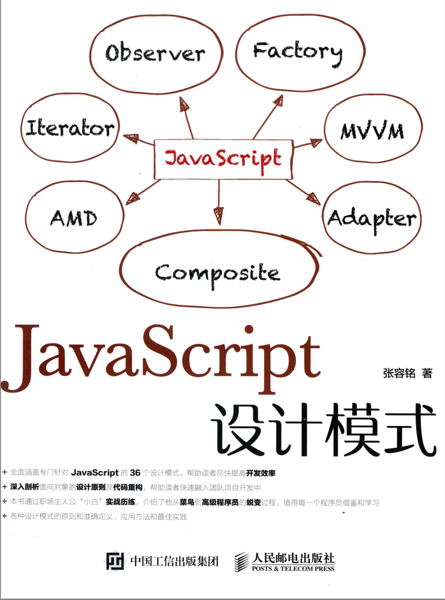

<!--
 * @Author: Miya Wang
 * @Date: 2022-02-14 15:07:37
 * @LastEditors: Miya Wang
 * @LastEditTime: 2022-02-17 18:01:54
 * @Description: 项目说明
-->
# JavaScript-Design-Pattern

## 项目介绍

本项目是《JavaScript 设计模式》（张容铭著）的读书笔记，配合[知乎专栏](https://www.zhihu.com/column/c_1066761682327691264)阅读效果更佳。

本项目以代码为主，知乎专栏以提炼知识点和脑图为主。

图书长这样



## 适合人群

书中已言明，适合以下几类读者：

- 读者有点 JavaScript 基础，想要更深入地学习 JavaScript，并成为一名标准 Web 开发人员或前端工程师；
- 读者主要是以前从事 Java 或者 C++ 等编程语言的程序员，现如今想转行从事前端开发……
- 读者主要对设计模式感兴趣……
- 从事前端开发的专业人员

## 项目目录

```
- images                     // 需要用到的 image 资源

- ***.js                     // 对应章节的代码

```
